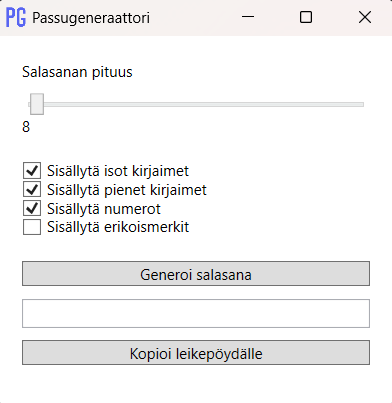

# 🔐 Passugeneraattori

**Passugeneraattori** on yksinkertainen mutta tehokas Windows-sovellus, jolla voit generoida turvallisia salasanoja helposti ja nopeasti.

---

## ✨ Ominaisuudet

- Valitse salasanan pituus
- Valitse mitä merkkejä haluat käyttää:
  - Isot kirjaimet (A-Z)
  - Pienet kirjaimet (a-z)
  - Numerot (0-9)
  - Erikoismerkit (!@#€%...)
- Kopioi salasana napin painalluksella
- Tyylikäs ja kevyt käyttöliittymä
- Ei asennusta — toimii yhdellä EXE-tiedostolla

---

## 🚀 Käyttö

1. Lataa `Passugeneraattori.exe` [Releases-välilehdeltä](https://github.com/Warjoisa/Passugeneraattori/releases)
2. Avaa ohjelma
3. Valitse asetukset ja paina **Generoi salasana**
4. Kopioi ja käytä!

---

## 🛡️ Tietoturva

Tämä sovellus toimii täysin paikallisesti. Mitään salasanoja ei tallenneta eikä lähetetä mihinkään.

---

## 🐾 Pieni salainen viesti

> Tämä ohjelma sisältää salaisen viestin... jos osaat etsiä 👀

---

## 📄 Lisenssi

MIT. Käytä vapaasti.
